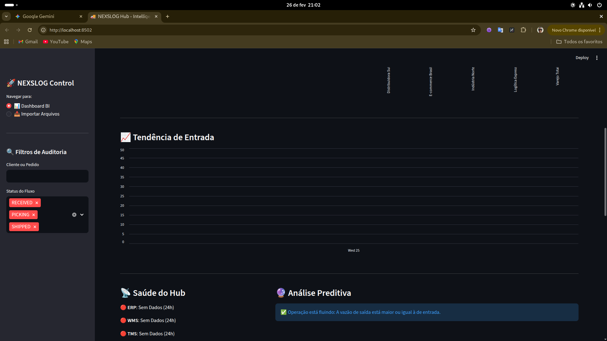
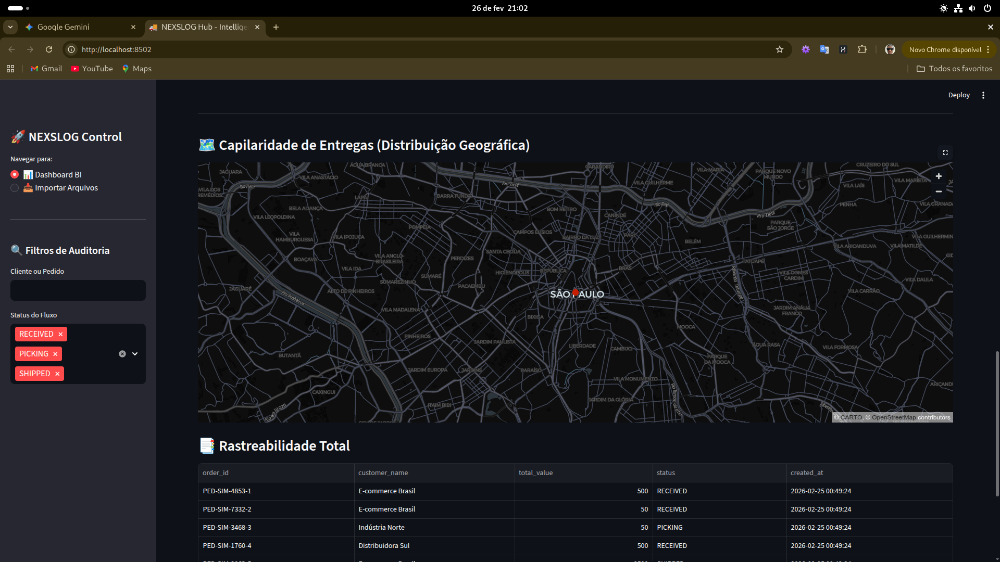

🚀 NEXSLOG Hub - Inteligência Logística
O NEXSLOG Hub é uma central de inteligência e monitoramento estratégico para operações logísticas. O sistema integra e audita o fluxo de dados entre ERP, WMS e TMS, permitindo a identificação em tempo real de gargalos operacionais, previsibilidade de faturamento e saúde do ecossistema de dados.

📸 Visualização do Sistema
Dashboard Principal e KPIs
Inteligência e Saúde dos Dados

## 📸 Demonstração

|      Dashboard Principal      |        Análise Preditiva         |      Mapa de Calor      |
| :---------------------------: | :------------------------------: | :---------------------: |
|  |  |  |

<i>Monitoramento de tendências, saúde do Hub e capilaridade geográfica.</i>

📊 Funcionalidades Principais
Monitoramento Operacional
Meta de Faturamento do Dia: Acompanhamento percentual e financeiro das metas de saída (atualizado em tempo real).

KPIs de Fluxo: Visualização instantânea de Volume Total, pedidos aguardando WMS e Lead Time Médio.

Gargalos por Status: Gráfico de barras identificando em qual etapa (Received, Picking, Shipped) os pedidos estão retidos.

Inteligência e Predição
Análise Preditiva: Algoritmo que identifica se a vazão de saída está saudável em relação à entrada.

Saúde do Hub: Status de conectividade e atualização de dados das fontes ERP, WMS e TMS.

Concentração de Receita: Visão detalhada de faturamento por unidade de negócio ou canal (E-commerce, Indústria, Varejo).

Auditoria e Geolocalização
Capilaridade de Entregas: Mapa interativo mostrando a distribuição geográfica das operações.

Rastreabilidade Total: Tabela detalhada com filtros de auditoria por cliente, pedido ou status do fluxo.

🛠️ Stack Tecnológica
Linguagem: Python 3.13.9

Frontend: Streamlit (Interface reativa e intuitiva)

Banco de Dados: SQLModel / SQLAlchemy (Persistência e modelagem)

Gestão de Dependências: Poetry

Testes Automáticos: Pytest (Com mocks de interface para validação headless)

Qualidade de Código: Taskipy (Automação de tarefas)

🚀 Como Executar o Projeto
Clone o repositório:

Bash

git clone https://github.com/douglasfariasil/nexslog.git
cd nexslog
Instale as dependências com Poetry:

Bash

poetry install
Inicie o Dashboard:

Bash

poetry run streamlit run nexslog/dashboard.py
🧪 Qualidade e Testes
O projeto segue rigorosos padrões de desenvolvimento. A suíte de testes utiliza Mocks e Monkeypatching para validar o comportamento do dashboard sem depender de um navegador real.

Bash

# Rodar todos os testes

poetry run pytest

# Rodar via Taskipy (se configurado)

task test
📈 Roadmap / Próximos Passos
[ ] Integração com APIs reais de transportadoras (TMS).

[ ] Sistema de alertas via WhatsApp/E-mail para pedidos parados há > 24h.

[ ] Exportação de relatórios em PDF/Excel.

Desenvolvido por [Douglas Faria da Silva] Conectando dados para mover o mundo.
